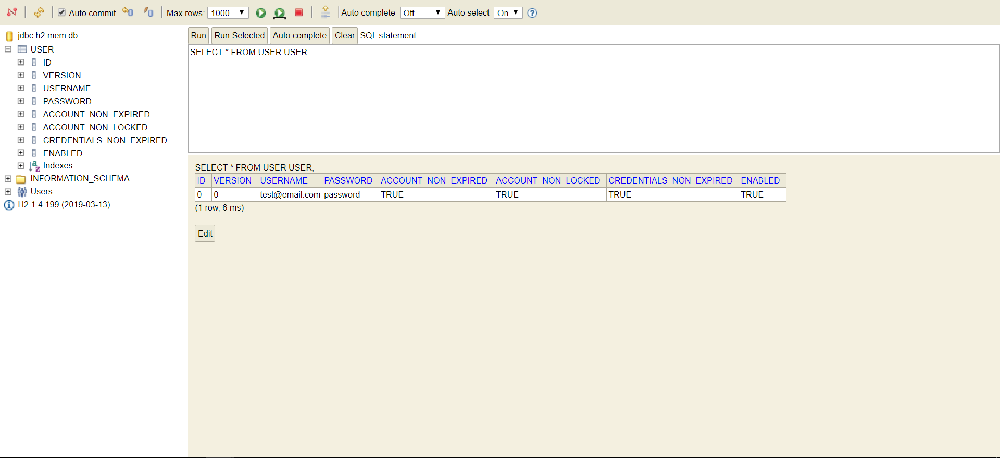
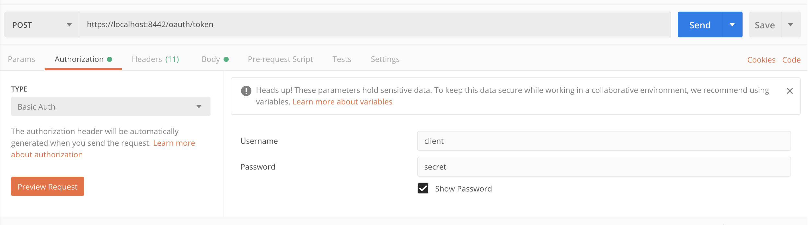
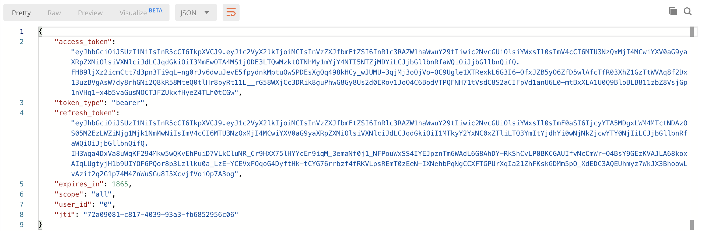
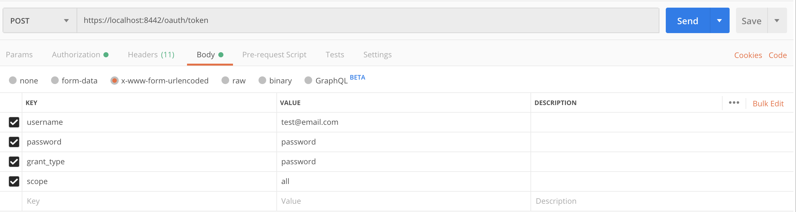

# OAuth2 

### In memory H2 database console

- http://localhost:8081/h2-console

   

### Authorization end point

POST https://localhost:8442/oauth/token

### Database password BCrypt

- https://www.browserling.com/tools/bcrypt

- http://localhost:8081/oauth/check_token?token=b5bad5a8-2df3-441a-8c4f-73ba237a2741

### Links

- https://www.baeldung.com/spring-security-oauth-jwt
- https://docs.spring.io/spring-security-oauth2-boot/docs/current/reference/htmlsingle/
- https://blog.monkey.codes/how-to-use-jwt-and-oauth-with-spring-boot/
- https://blog.marcosbarbero.com/centralized-authorization-jwt-spring-boot2/

### Docker 

- https://www.baeldung.com/docker-compose
- https://medium.com/@fndomoraes/running-docker-containers-on-maven-integration-tests-ee071bcd743f
- https://dzone.com/articles/advanced-functional-testing-in-spring-boot-by-usin

$ docker-compose up 

###Certificate

####Articles

 - https://www.baeldung.com/spring-boot-https-self-signed-certificate
 - https://www.baeldung.com/spring-security-oauth-jwt

####Keys (PKCS12)

 keytool -genkeypair -alias my-key -keyalg RSA -keysize 2048 -storetype PKCS12 -keystore my-keystore.pfx -validity 3650

 my-keystore-password

####Public Key

  keytool -list -rfc --keystore my-keystore.pfx | C:\openssl-1.1\x64\bin\openssl x509 -inform pem -pubkey